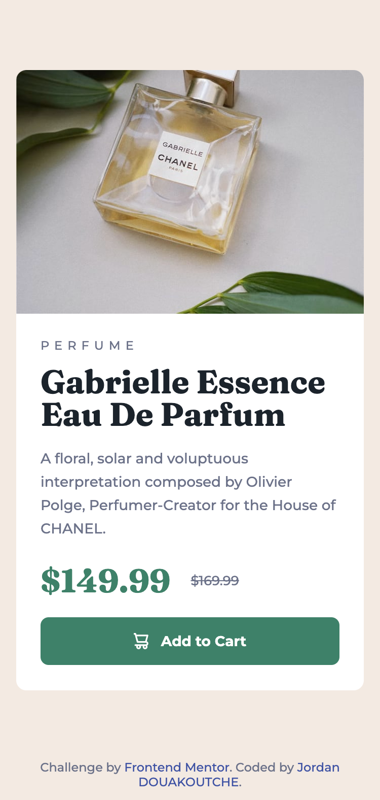

# Frontend Mentor - Product preview card component solution

This is a solution to the [Product preview card component challenge on Frontend Mentor](https://www.frontendmentor.io/challenges/product-preview-card-component-GO7UmttRfa). Frontend Mentor challenges help you improve your coding skills by building realistic projects.

## Table of contents

- [Overview](#overview)
  - [The challenge](#the-challenge)
  - [Screenshot](#screenshot)
  - [Links](#links)
- [My process](#my-process)
  - [Built with](#built-with)
  - [Useful resources](#useful-resources)
- [Author](#author)
- [Acknowledgments](#acknowledgments)

## Overview

### The challenge

Users should be able to:

- View the optimal layout depending on their device's screen size
- See hover and focus states for interactive elements

### Screenshot

Mobile

Desktop

### Links

- Solution URL: [https://github.com/douako-j/Product-preview-card-component](https://github.com/douako-j/Product-preview-card-component)
- Live Site URL: [https://douako-j.github.io/Product-preview-card-component/](https://douako-j.github.io/Product-preview-card-component/)

## My process

### Built with

- Semantic HTML5 markup
- CSS custom properties
- Flexbox
- CSS Grid
- Mobile-first workflowstyles

### Useful resources

- [Dyma courses](https://dyma.fr/) - This courses helped me Learn HTML CSS SASS and GIT.

**Note: Delete this note and replace the list above with resources that helped you during the challenge. These could come in handy for anyone viewing your solution or for yourself when you look back on this project in the future.**

## Author

- Website [nkoyin.fr](http://www.nkoyin.fr/)
- GitHub [@douako-j](https://github.com/douako-j)
- Instagram [@nkoyinn](https://www.instagram.com/nkoyinn/)
- Frontend Mentor - [@douako-j](https://www.frontendmentor.io/profile/douako-j)

## Acknowledgments

- [Steps to replicate a design with only HTML and CSS](https://devchallenges-blogs.web.app/how-to-replicate-design/)
